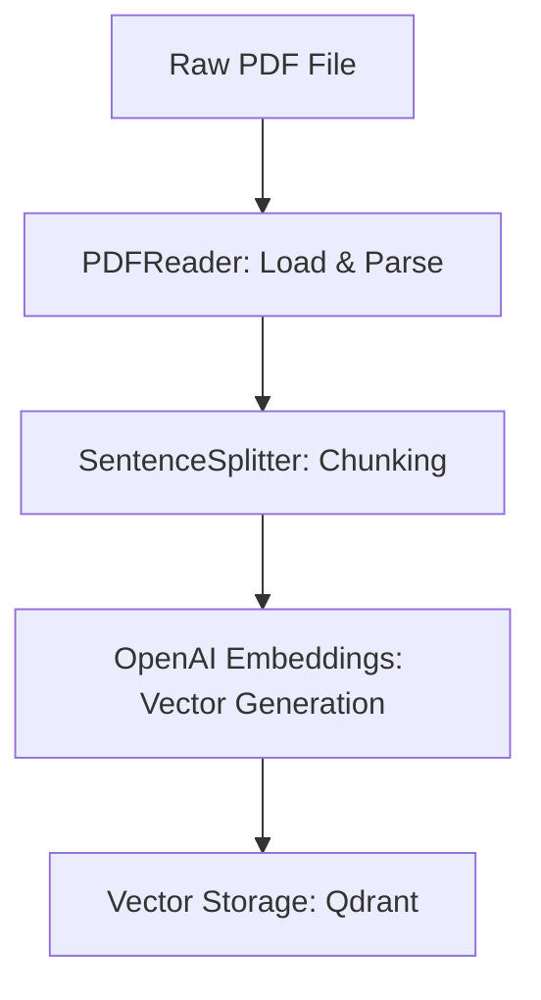

# PDF Loading & Text Embedding: Interview Guide

This guide explains how to extract, chunk, and embed PDF content for a RAG system, based on the implementation in `data_loader.py`.

---

## 1. Core Concepts of Data Loader in RAG

When building a RAG (Retrieval-Augmented Generation) pipeline, we cannot pass an entire PDF directly to the LLM. Instead, we perform the following pipeline:



1.  **PDF Reading**: Extract raw text content from the PDF file page-by-page.
2.  **Sentence Chunking**: Split long documents into smaller, overlapping segments (chunks).
    *   *Why?* To fit inside the LLM's context window and to ensure we only retrieve the most relevant sections of text for a user's question, reducing noise.
    *   *Chunk Size & Overlap*: A `chunk_size` of 1000 characters with a `chunk_overlap` of 200 characters ensures that sentences aren't cut in half without context; the overlap acts as a bridge between chunks.
3.  **Embeddings**: Convert text chunks into a list of numbers (a vector) using OpenAI's `text-embedding-3-large` model. This vector captures the **semantic meaning** of the text.

---

## 2. Line-by-Line Code Explanation

Here is the line-by-line breakdown of `data_loader.py`:

*   **Line 1**: `from openai import OpenAI` — Imports the official OpenAI client SDK to generate vector embeddings.
*   **Line 2**: `from llama_index.readers.file import PDFReader` — Imports LlamaIndex's PDF reader to load and extract text from local PDF files.
*   **Line 3**: `from llama_index.core.node_parser import SentenceSplitter` — Imports LlamaIndex's splitter tool that slices text at sentence boundaries.
*   **Line 4**: `from dotenv import load_dotenv` — Imports the helper to load configurations.
*   **Line 6**: `load_dotenv()` — Loads environment variables (specifically your `OPENAI_API_KEY`).
*   **Line 8**: `client = OpenAI()` — Instantiates the OpenAI API client.
*   **Line 9**: `EMBED_MODEL = "text-embedding-3-large"` — The model we are using. *(Note: Fixed a typo from "text-embeeding-3-large" to "text-embedding-3-large")*.
*   **Line 10**: `EMBED_DIM = 3072` — The dimensions of the resulting vector list.
*   **Line 12**: `splitter = SentenceSplitter(chunk_size=1000, chunk_overlap=200)` — Sets up our chunking rules.
*   **Line 14**: `def load_and_chunk_pdf(path: str):` — Declares a function to parse a PDF file at `path` and return text chunks.
*   **Line 15**: `docs = PDFReader().load_data(file=path)` — Loads the PDF file and returns a list of document page objects.
*   **Line 16**: `texts = [d.text for d in docs if getattr(d, "text", None)]` — Extracts the raw text from each successfully loaded page.
*   **Line 17-19**: Loops through each page's text and uses the `splitter` to divide it into chunks, appending them all to the `chunks` list.
*   **Line 20**: Returns the list of text chunks.
*   **Line 22**: `def embed_texts(texts: list[str]) -> list[list[float]]:` — Declares a function to convert a list of text strings into vector lists.
*   **Line 23-26**: Calls the OpenAI Embeddings endpoint with our list of texts.
*   **Line 27**: Loops through OpenAI's response and extracts the raw float vector list for each input text.

---

## 3. Example Scenario: Processing a User Manual

Here is a robust implementation showing how the `data_loader.py` logic is combined with exception handling and unit tests.

### Implementation

```python
import logging
from typing import List
from openai import OpenAI
from llama_index.readers.file import PDFReader
from llama_index.core.node_parser import SentenceSplitter

app_logger = logging.getLogger("uvicorn.error")

class PDFProcessor:
    def __init__(self, api_key: str = None) -> None:
        """Initializes the processor and OpenAI client."""
        self.client = OpenAI(api_key=api_key)
        self.embed_model = "text-embedding-3-large"
        self.splitter = SentenceSplitter(chunk_size=1000, chunk_overlap=200)

    def load_and_chunk(self, file_path: str) -> List[str]:
        """Loads a PDF file and chunks it. Handles missing or unreadable files."""
        try:
            reader = PDFReader()
            docs = reader.load_data(file=file_path)
            
            # Extract text safely
            texts = [d.text for d in docs if getattr(d, "text", None)]
            if not texts:
                raise ValueError("No text could be extracted from the PDF.")
                
            chunks = []
            for t in texts:
                chunks.extend(self.splitter.split_text(t))
                
            return chunks
        except Exception as error:
            app_logger.error(f"Error reading PDF file {file_path}: {str(error)}")
            raise error

    def generate_embeddings(self, texts: List[str]) -> List[List[float]]:
        """Generates embeddings for a list of texts using the OpenAI API."""
        if not texts:
            return []
            
        try:
            response = self.client.embeddings.create(
                model=self.embed_model,
                input=texts
            )
            return [item.embedding for item in response.data]
        except Exception as error:
            app_logger.error(f"Failed to generate embeddings from OpenAI: {str(error)}")
            raise error
```

### Unit Tests

```python
import pytest
from unittest.mock import MagicMock

def test_generate_embeddings_empty() -> None:
    """Verifies that an empty input list returns an empty list without calling API."""
    processor = PDFProcessor(api_key="mock_key")
    # Mock OpenAI client
    processor.client = MagicMock()
    
    result = processor.generate_embeddings([])
    assert result == []
    processor.client.embeddings.create.assert_not_called()

def test_generate_embeddings_success() -> None:
    """Verifies that embeddings are correctly extracted from mock OpenAI response."""
    processor = PDFProcessor(api_key="mock_key")
    
    # Mock the OpenAI response structure
    mock_data_item = MagicMock()
    mock_data_item.embedding = [0.1, 0.2, 0.3]
    mock_response = MagicMock()
    mock_response.data = [mock_data_item]
    
    processor.client = MagicMock()
    processor.client.embeddings.create.return_value = mock_response
    
    result = processor.generate_embeddings(["hello world"])
    
    assert result == [[0.1, 0.2, 0.3]]
    processor.client.embeddings.create.assert_called_once_with(
        model="text-embedding-3-large",
        input=["hello world"]
    )
```
